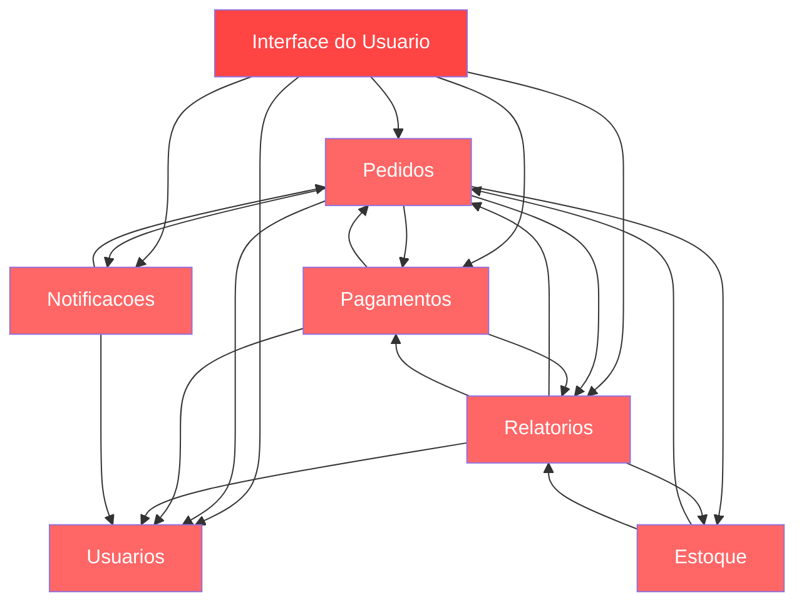
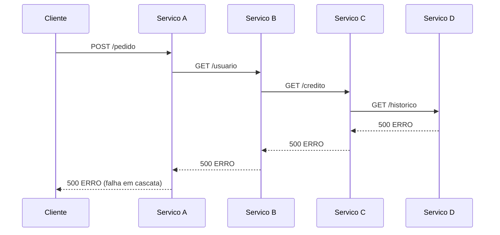
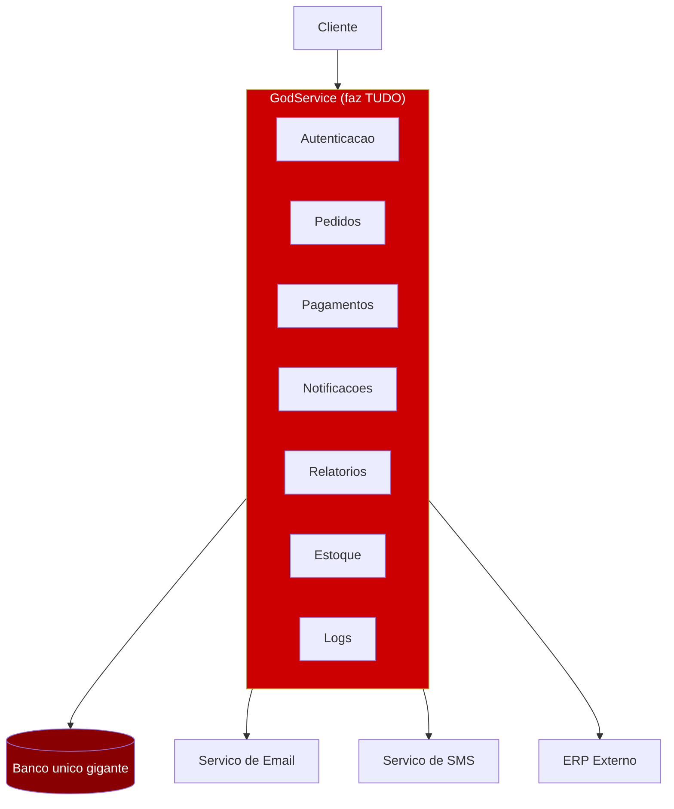
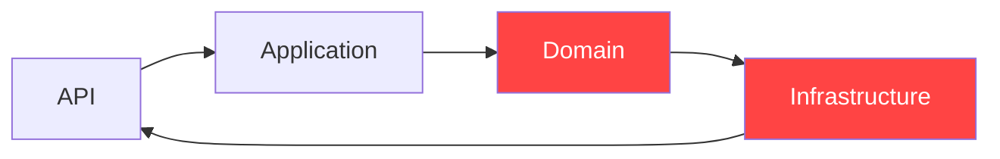
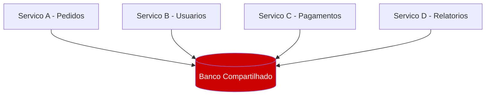
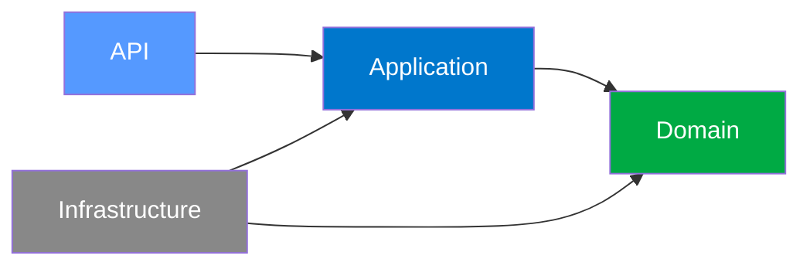
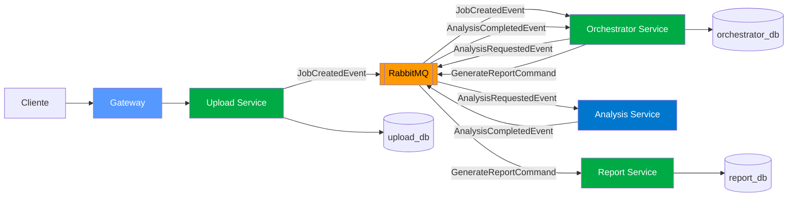
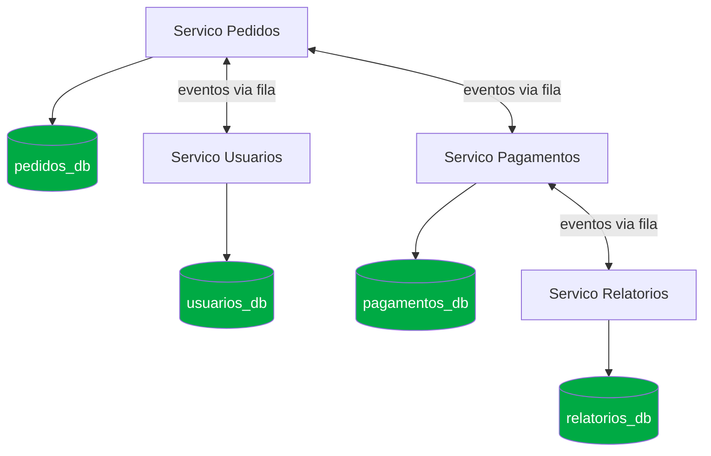
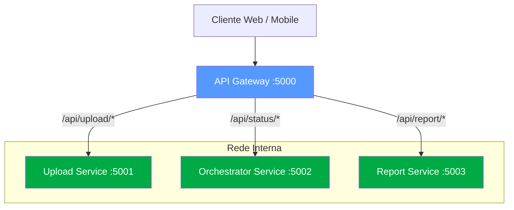
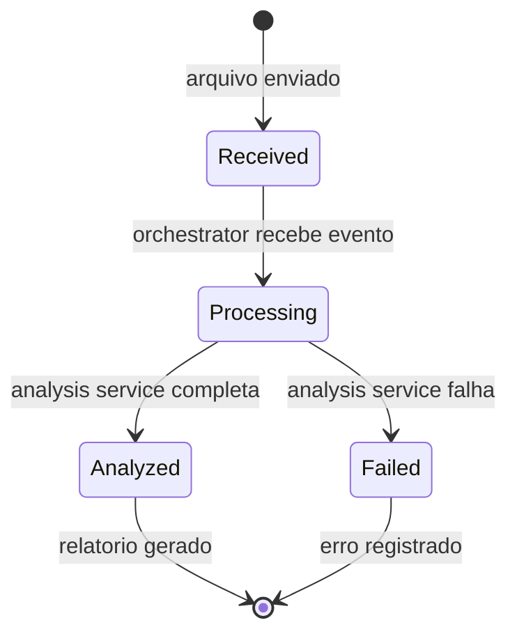

# Exemplos de Arquiteturas — Boas e Ruins

---

## RUINS

---

### 1. Monolito com acoplamento total

Todos os modulos dependem diretamente uns dos outros. Qualquer mudanca pode quebrar tudo.

**Problemas:**
- Dependencia circular (Pedidos → Pagamentos → Pedidos)
- Impossivel escalar um modulo sem escalar tudo
- Um bug em Estoque pode derrubar Pagamentos

---

### 2. Microservicos chamando uns aos outros diretamente (acoplamento sincrono)

Cada servico chama o proximo via HTTP. Se um cai, todos caem.

**Problemas:**
- Falha em cascata: um servico derruba a cadeia toda
- Alto acoplamento temporal (todos precisam estar no ar ao mesmo tempo)
- Latencia acumulada (A espera B, B espera C, C espera D)

---

### 3. God Service (servico que faz tudo)

Um unico servico acumula responsabilidades de varios dominios.

**Problemas:**
- Times diferentes editando o mesmo codigo = conflitos
- Impossivel fazer deploy parcial
- Banco vira gargalo de tudo
- Nao tem como escalar so a parte de Relatorios, por exemplo

---

### 4. Dependencia circular entre camadas

A camada de Infraestrutura conhece a camada de API — inversao errada.

**Problema:** Domain nao pode depender de Infrastructure (banco, HTTP, etc). Domain deve ser puro e isolado. Infrastructure que depende de Domain, nunca o contrario.

---

### 5. Banco de dados compartilhado entre microservicos

**Problemas:**
- Qualquer servico pode alterar dados de outro sem contrato
- Schema unico: mudar uma tabela quebra todos os servicos
- Impossivel migrar um servico para outro banco de dados
- Acoplamento invisivel via banco

---

---

## BOAS

---

### 6. Clean Architecture — dependencias corretas

As dependencias apontam sempre para dentro. Domain nao conhece nada externo.

**Correto:**
- Domain: entidades puras, sem dependencias externas
- Application: casos de uso, usa interfaces definidas no Domain
- Infrastructure: implementa as interfaces (banco, HTTP, fila)
- API: ponto de entrada, delega para Application

---

### 7. Microservicos com comunicacao assincrona (Event-Driven)

Como o projeto Hackton funciona. Servicos nao se chamam diretamente — publicam eventos.

**Vantagens:**
- Servico cai? Os eventos ficam na fila, processamento retoma depois
- Cada servico tem seu proprio banco
- Facil adicionar novo servico sem alterar os existentes

---

### 8. Banco de dados por servico (Database per Service)

**Vantagens:**
- Cada servico pode usar o banco mais adequado (PostgreSQL, MongoDB, Redis...)
- Schema independente: mudar pedidos_db nao afeta pagamentos_db
- Times autonomos

---

### 9. API Gateway com roteamento

Um unico ponto de entrada, sem expor servicos internos diretamente.

**Vantagens:**
- Cliente conhece apenas um endereco
- Servicos internos nao ficam expostos
- Gateway centraliza autenticacao, rate limiting, logging

---

### 10. Fluxo de status de um Job (State Machine)

Estados bem definidos com transicoes claras — sem estados ambiguos.

**Vantagens:**
- Sempre se sabe em que estado o Job esta
- Transicoes invalidas sao impossibles (nao tem como ir de Failed para Analyzed)
- Facil de auditar e debugar
